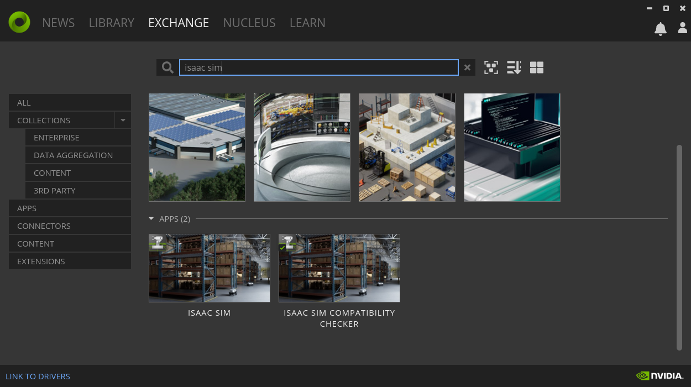

# Piper_isaac_sim

测试系统配置：ubuntu22.04+4060显卡

## 1、配置系统环境

### 1）安装显卡驱动

[下载链接](https://www.nvidia.com/Download/index.aspx)

### 2）下载NVIDIA Omniverse

[下载链接](https://www.nvidia.com/en-us/omniverse/)

### 3）下载isaac sim

> 安装isaac sim之前，可以使用ISAAC SIM COMPATIBILITY CHECKER检查一下，电脑配置是否满足要求

在Omniverse里面下载isaac sim



下载完成之后可以启动isaac sim


4）配置ROS2

[ROS2 humble desktop full](https://docs.ros.org/en/humble/Installation/Ubuntu-Install-Debs.html)

5）配置moveit2 

[Moveit2](https://docs.ros.org/en/humble/Installation/Ubuntu-Install-Debs.html)

安装完Moveit2之后，需要安装一些依赖：

```
sudo apt-get install ros-humble-control* ros-humble-joint-trajectory-controller ros-humble-joint-state-* ros-humble-gripper-controllers ros-humble-trajectory-msgs
```

isaac sim和moveit通讯的功能包：

```
sudo apt install ros-humble-topic-based-ros2-control
```

## 2、使用方法

### 1）创建名为agilex_ws/src的文件夹

```
mkdir -p agilex_ws/src
```

2）下载代码

### 进入agilex_ws/src文件夹

```
cd agilex_ws/src
```

下载代码

```
https://github.com/agilexrobotics/piper_isaac_sim.git
```

### 3）编译代码

进入agilex_ws文件夹

```
cd agilex_ws
```

编译

```
colcon build
```

### 4）启动isaac sim，导入USD


打开isacc sim之后，在content中找到存放USD的路径，双击打开


成功导入后，点击三角按钮开始仿真


### 5）启动moveit

进入agilex_ws文件夹

```
cd agilex_ws
```

声明环境变量

```
source install/setup.bash
```

启动moveit

```
ros2 launch piper_camera_moveit_config demo.launch.py
```


### 6）联合仿真

在moveit中，拖动悬浮球控制机械臂运动


